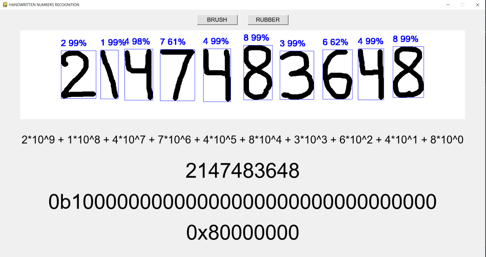
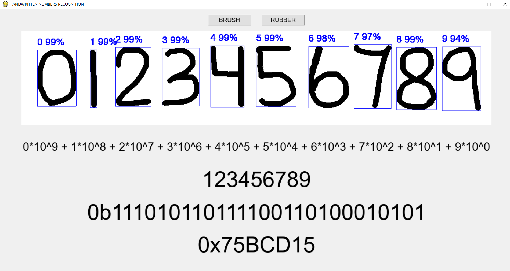

# Handwritten-Digits-Recognizer-2.0

Actually Mousewritten Numbers Recognizer using CNN (Convolutional Neural Networks) in Python with Keras

This file includes the following chapters:
1. Code Requirements
2. Project description
3. How to install
4. Tips

# 1. Code Requirements:
Python 3.8 with following modules installed:
* Pygame 1.9
* NumPy
* TensorFlow 2.3
* Keras
* OpenCV 4.4 for Python
* Matplotlib

# 2. Project Description:

# 3. How to install:

# 4. Tips:

