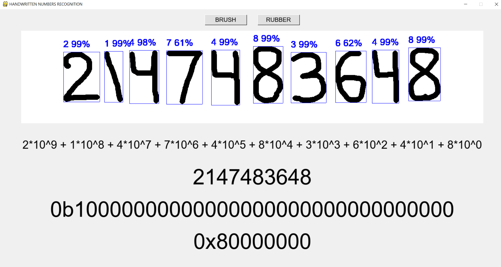
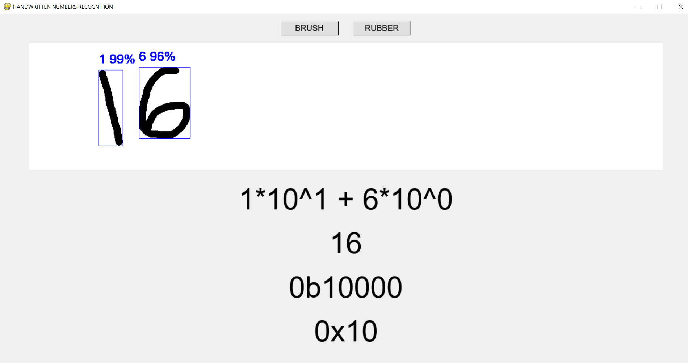
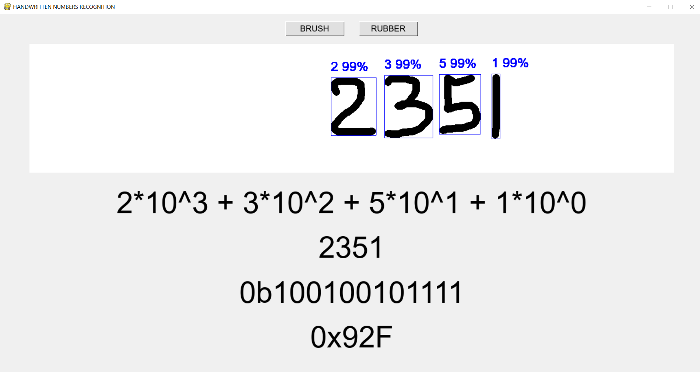
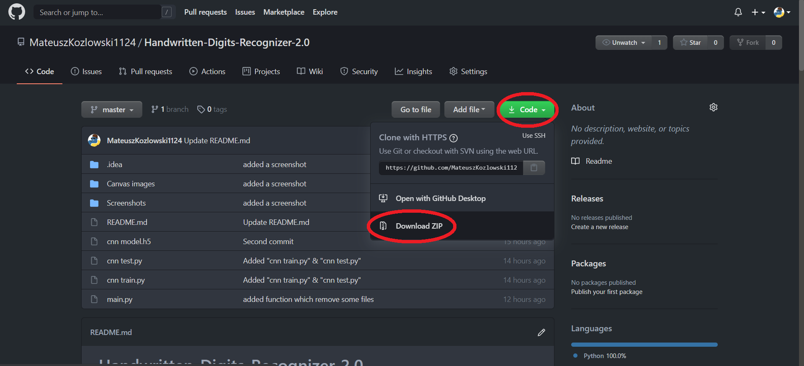
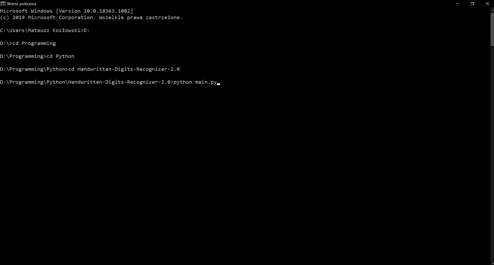
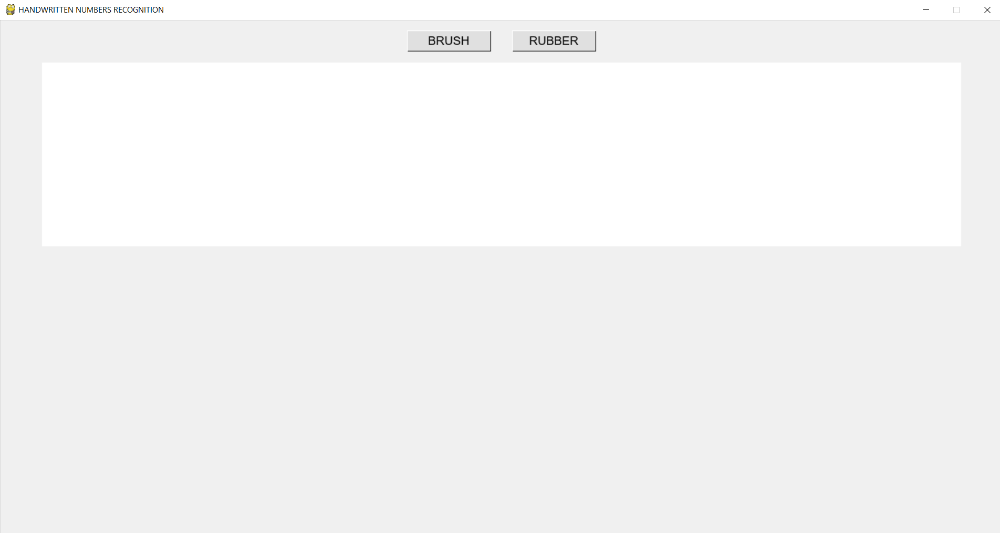
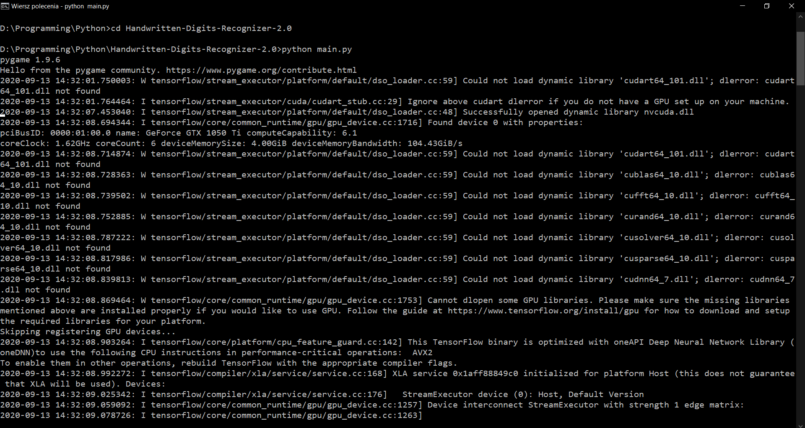
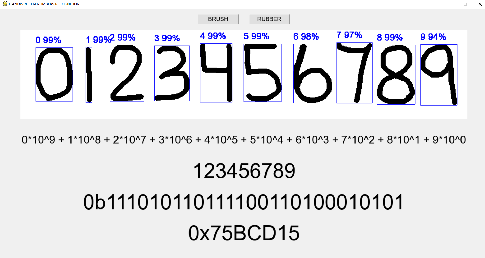

-> [LINK TO A VIDEO SHOWING HOW THE PROGRAM EXACTLY WORKS](https://drive.google.com/file/d/1hSDKI61Yxf8yH8wNy6vLrCUpFmyFXZ5H/view?usp=sharing) <-

# Handwritten-Digits-Recognizer-2.0

Actually Mousewritten Numbers Recognizer using CNN (Convolutional Neural Networks) in Python with Keras

This file includes the following chapters:
1. Code Requirements
2. Project description
3. How to install
4. Tips

# 1. Code Requirements:
Python 3.8 with following modules installed:
* Pygame 1.9
* NumPy
* TensorFlow 2.3
* Keras
* OpenCV 4.4 for Python
* Matplotlib

# 2. Project Description:
The project is very simple and intuitive to use. Contains 2 tools: brush and rubber, which are used to draw on white canvas.
After the drawing is finished, the recognition process starts automatically.
First, the tools from the OpenCV library find contours that can be digits.
Later these contours are converted into inputs for the neural network, which tries to recognize the digits labels.
Finally, the results are combined into numbers that are shown in the decimal, binary, and hexadecimal system.

# 3. How to install:
If you're familiar with git you can clone the repo. Otherwise you can simply download whole project as a compressed folder.

Then you need to make sure your device meets the requirements in chapter 1 (appropriate libraries installed).
You can install them with pip from the command line.

Finally run the program using command line. Navigate to the directory, where the project is located and type python main.py

Wait a few second...
And you should see sth like that:

In the command line there may be some errors and warnings, but if you can use program and numbers are predicted correctly, then you can just ignore the erros.

If program doesn't work at all, read carefully the errors and try to find rezolution on Stack Overflow or elsewhere. You should necessarily make an issue in the repo too.

# 4. Tips:
Digits recognition is not perfect. This is mainly due to the fact that the training data for the neural network is a popular set of MNIST handwritten digits. In our program, however, numbers are written with the mouse, so it can be difficult to keep the characters in the right shape. Sample examples of each digit are provided below. Pay special attention to 1, 4, 6, 7 and 9.

